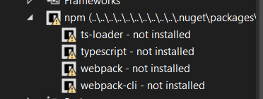

# JSLogger

## This library provides a simple way to log messages to the JavaScript console from Blazor, using JS Interop.
- It is not an implementation of ILogger, but rather mimics most methods of ILogger as async ValueTask.

### Usage
See the 'Sandbox' demo in the 'src' folder for a working example.

### Installation
- When you install the NuGet package you might see a Dependencies reference to NPM.
The library does not require any NPM packages to run.
The issue is being investigated, but for now you can safely ignore it.

### Release Notes
- 8.1.1
  - Added `LogRaw` method to log raw (not formatted with template) messages with optional style.
    - i.e. `LogRaw("Hello World", "color: red; font-size: 20px;")`
- 8.1.0 
  - **Breaking Changes** 
    - Renamed `Logger` to `JSLogger` and `LoggerConfig` to `JSLoggerConfig`.
  - Added JSLoggerService that uses IJSRuntime directly via loaded script
rather than the IJSObjectReference module.
    - see `App.razor` for the script reference and `Program.cs` for the service registration.
    - NOTE: The loaded script could also be used directly in your own *.js file.
- 8.0.0 - Initial release for .NET 8

